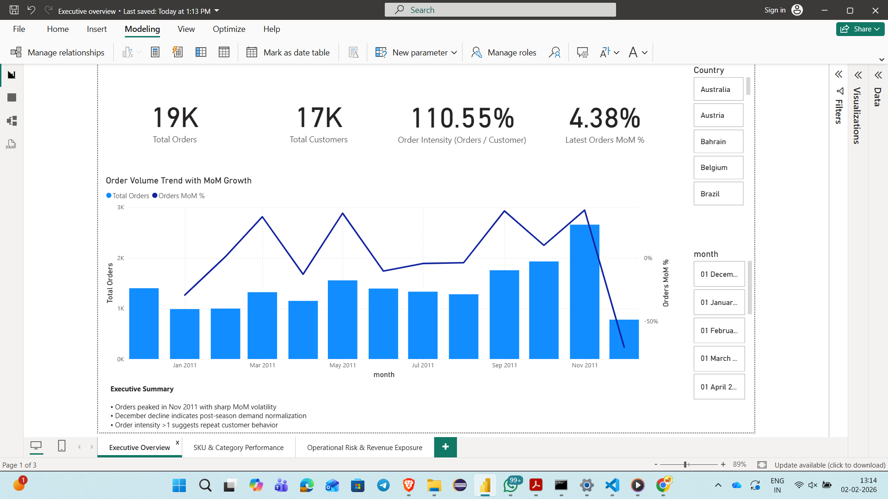
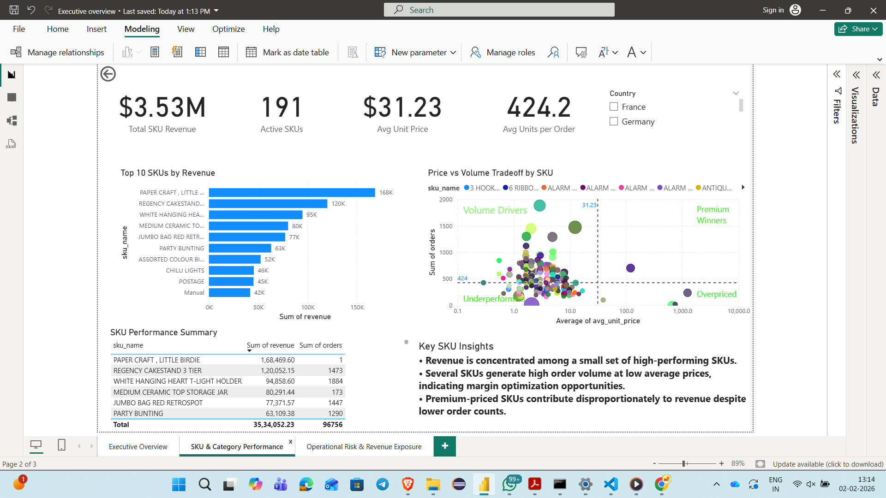
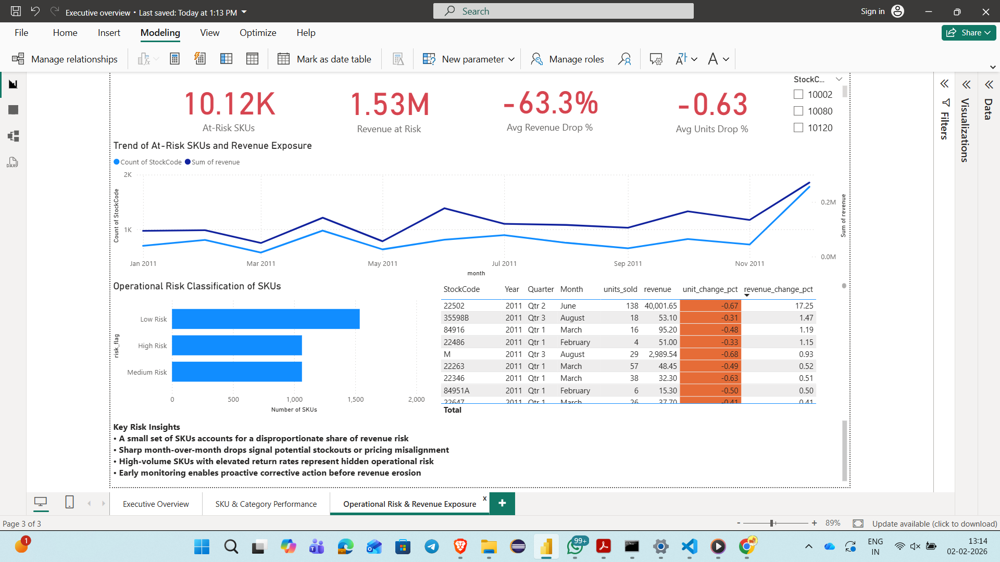

# Marketplace Performance & Risk Analytics

## Overview
This project demonstrates an end-to-end marketplace analytics workflow that transforms raw eCommerce transaction data into executive-ready insights. The analysis focuses on marketplace performance, SKU concentration, pricing signals, and operational risk indicators to support data-driven decision-making.

The project simulates the work of a Marketplace / Business Intelligence Analyst by combining SQL, Python, Power BI, and Excel to move from raw data ingestion to leadership-facing dashboards.

---

## Business Questions Addressed
- Which SKUs and product categories drive the majority of marketplace revenue?
- How concentrated is revenue across the product catalog?
- Are there early signals of pricing pressure or demand slowdown?
- Which SKUs show operational or demand volatility risks?
- How can leadership monitor marketplace health through executive dashboards?

---

## Data & Tools

### Data Source
- Public eCommerce transaction dataset (order-level retail data)

### Tech Stack
- **Python**: Data cleaning, feature engineering, business insights
- **SQL (SQLite)**: KPI aggregation and marketplace performance analysis
- **Power BI**: Executive dashboards and visual analytics
- **Excel**: KPI exports for stakeholder reporting
- **GitHub**: Version control and project documentation

---

## Project Architecture
marketplace-analytics-dashboard/
├── data/
│ ├── raw/
│ │ └── Online Retail.xlsx
│ └── processed/
│ ├── online_retail_cleaned.csv
│ └── exports/
│ ├── kpi_marketplace_performance.csv
│ ├── sku_deep_dive.csv
│ ├── operational_risk_metrics.csv
│ └── executive_sku_alerts.csv
├── notebooks/
│ ├── 01_data_cleaning_and_features.ipynb
│ ├── 02_load_to_sqlite.ipynb
│ ├── 03_run_kpis_export_csv.ipynb
│ └── 04_business_insights.ipynb
├── sql/
│ ├── 01_create_tables.sql
│ ├── 02_kpi_marketplace_performance.sql
│ ├── 03_sku_brand_channel_deep_dive.sql
│ ├── 04_operational_risk_metrics.sql
│ ├── 05_pricing_margin_analysis.sql
│ └── 06_executive_alerts.sql
├── dashboards/
│ └── screenshots/
├── README.md
└── requirements.txt

---

## Analytics Workflow

### 1. Data Cleaning & Feature Engineering (Python)
- Removed cancelled and invalid transactions
- Standardized date fields and created time-based features
- Calculated revenue at order and SKU levels
- Prepared clean datasets for reproducible analysis

### 2. Marketplace KPI Aggregation (SQL)
- Revenue, order volume, and SKU-level KPIs
- SKU, brand, and channel performance deep dives
- Pricing and margin proxy analysis
- Operational risk and demand volatility metrics

### 3. Business Insights (Python)
- Revenue concentration analysis (Pareto-style)
- Seasonality and demand trend analysis
- Identification of high-revenue SKUs with declining volume

### 4. Executive Reporting (Power BI & Excel)
- Executive dashboards for marketplace monitoring
- Clean KPI exports for leadership and cross-functional teams

---

## 📊 Power BI Dashboard Overview

This project includes an interactive Power BI dashboard designed to provide executive-level visibility into marketplace performance, SKU economics, and operational risk signals.

---

### 🧭 Executive Overview

**Purpose**
- Track total orders, customers, and order intensity
- Monitor month-over-month order growth
- Identify demand seasonality and volatility

---

### 📦 SKU & Category Performance

**Purpose**
- Identify top revenue-generating SKUs
- Analyze price vs volume trade-offs
- Segment SKUs into volume drivers, premium winners, and underperformers

---

### ⚠️ Operational Risk & Revenue Exposure

**Purpose**
- Detect SKUs with sharp month-over-month drops in units or revenue
- Quantify revenue exposure from at-risk SKUs
- Classify SKUs into Low, Medium, and High operational risk buckets

**Key Insights**
- A small subset of SKUs contributes disproportionately to revenue risk
- Sharp MoM declines signal potential stockouts or pricing misalignment
- Early identification enables proactive corrective action

---

## Key Insights Summary
- Marketplace revenue is highly concentrated, with a small subset of SKUs driving a disproportionate share of total revenue
- Clear seasonality patterns indicate demand peaks during specific periods
- Several high-revenue SKUs show declining unit volumes, signaling pricing or demand-side risk
- Operational metrics highlight volatility that could impact fulfillment SLAs if unmanaged

---

---

## Future Enhancements
- Automated data refresh and scheduling
- Demand and revenue forecasting models
- Expanded pricing analysis with cost data
- Threshold-based alerting for operational risk

---

## Author
**Subham Mangi**  
Marketplace Analytics | Business Intelligence | Data Analytics
